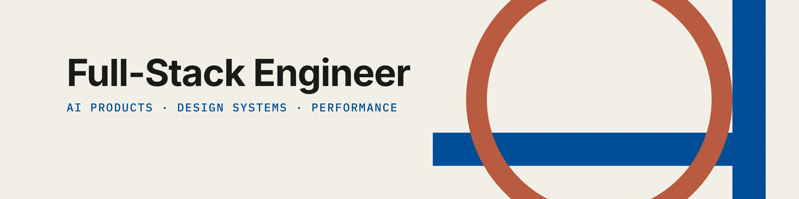

<picture>
  <source media="(prefers-color-scheme: dark)" srcset="assets/banner-dark@2x.png">
  <source media="(prefers-color-scheme: light)" srcset="assets/banner-light@2x.png">
  
</picture>

# Gavriel Mor

Full-stack engineer at Logz.io. Second engineer on OrionIQ, an agentic observability
product, where I own the interface end to end. I build the parts of large systems that
people actually touch, and the caching and rendering work underneath that decides
whether any of it feels good to use.

**Most of what I ship is private. This is what is public.**

---

## Open source

### Published

**[text-cascade](https://www.npmjs.com/package/text-cascade)** —
per-character text reveal for React, extracted from the animation work on my portfolio.
Dual ESM/CJS, fully typed, and reduced-motion handling that survives SSR.
[source](https://github.com/Gavriel-M/itsmor/tree/main/packages/text-cascade)

### Merged upstream

**[styled-components/xstyled#428](https://github.com/styled-components/xstyled/pull/428)** —
fixed a TypeScript inference bug in the `Space` type that was breaking IntelliSense.
Found it while building a design system on top of xstyled.

**[galangel/react-tip-magic](https://github.com/galangel/react-tip-magic)** —
upstreamed accessibility, focus-management and lifecycle fixes to Gal Angel's tour
library, which we build on
([#15](https://github.com/galangel/react-tip-magic/pull/15),
[#16](https://github.com/galangel/react-tip-magic/pull/16),
[#27](https://github.com/galangel/react-tip-magic/pull/27)).

---

## Projects

**[itsmor.com](https://github.com/Gavriel-M/itsmor)** — my portfolio. Next.js and
React 19, with the type animation pulled out into its own package and the hero geometry
built on three.js.

---

## At work, 2024 to now

- **OrionIQ**, since June 2026. Second engineer. Replaced the legacy AI agent across two
  applications, and built the page-context system that lets the agent read whatever page
  you are on.
- **LUI**, Logz.io's design system. I made the case for replacing a fragmented one, then
  led it.
- **SIEM platform migration**, March to June 2026, onto the new app, while acting as
  team lead.
- **AI features since 2024.** Agent reasoning surfaces, streaming, context, and the
  consumption metering and billing underneath.

---

## Stack

  
  &nbsp;
  
  &nbsp;
  

**Daily** — TypeScript · React · Node · TanStack Query and Router · Emotion · Nx

**Deeper than most** — Web Workers · OPFS · render scheduling · streaming · AWS Bedrock

---

Israel, moving to Munich. EU citizen.
[itsmor.com](https://itsmor.com) · [LinkedIn](https://linkedin.com/in/gavriel-mor)
